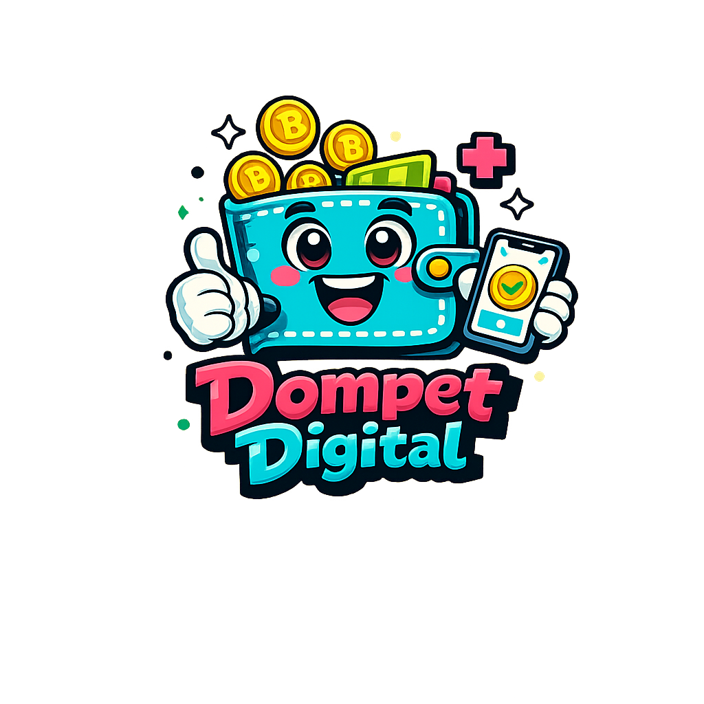
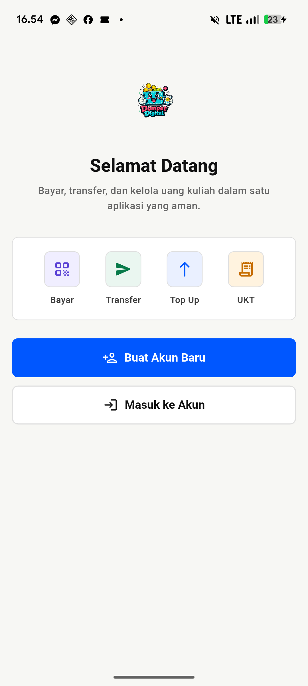
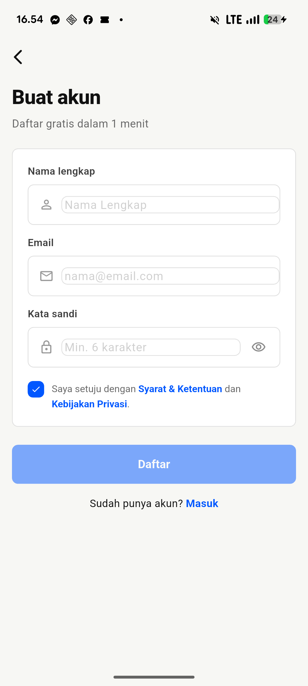
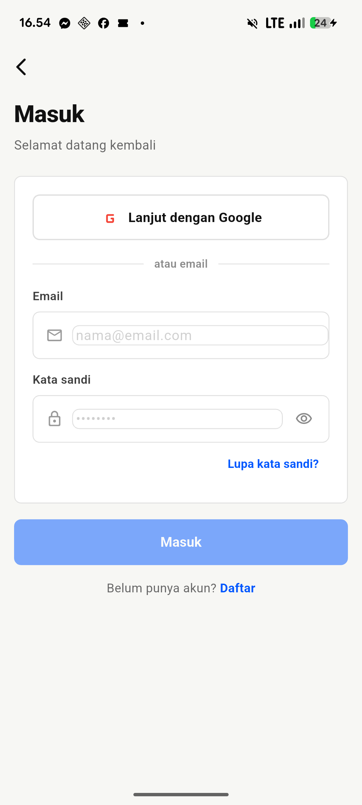
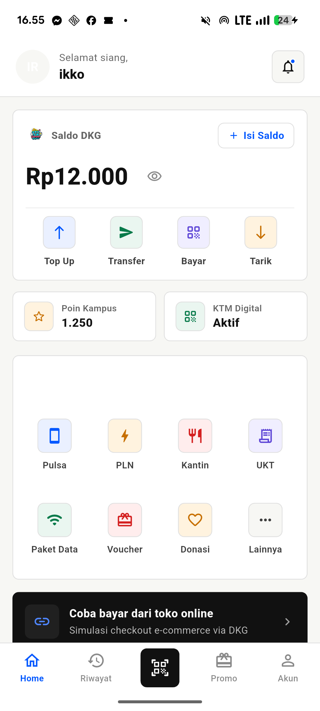
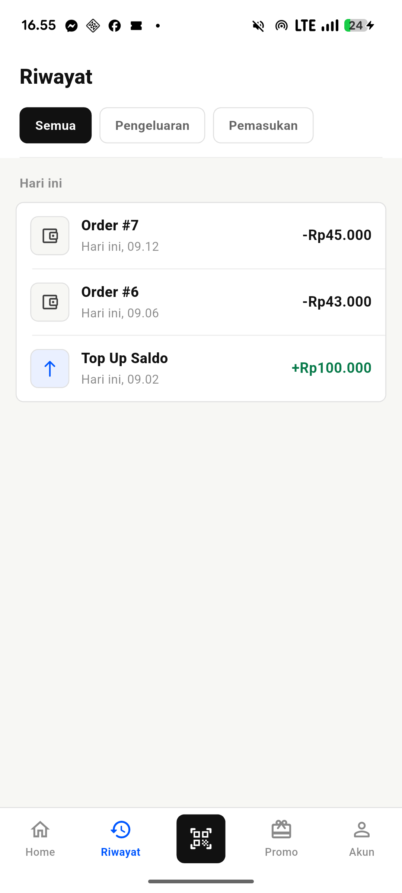
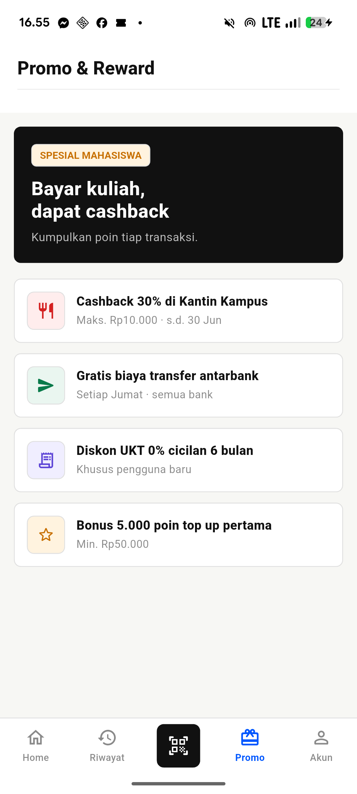
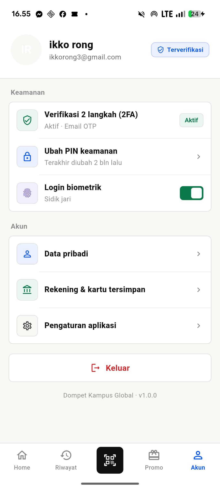

# Dompet Kampus Global (FE)



Aplikasi mobile e-money buat mahasiswa — bisa top-up, transfer, bayar pakai QR, dan kelola uang kuliah. Dibangun pakai Flutter dengan arsitektur Clean Architecture (BLoC pattern).

## Tampilan Aplikasi

<p align="center">
  &nbsp;&nbsp;
  &nbsp;&nbsp;
  
</p>

<p align="center">
  &nbsp;&nbsp;
  &nbsp;&nbsp;
  
</p>

<p align="center">
  
</p>

## Fitur

### Autentikasi
- Login/Register pakai email + password lewat Firebase Auth
- Google Sign-In
- Verifikasi email lewat OTP
- Deep link handling buat verifikasi email dari link yang dikirim ke inbox

### Two-Factor Authentication (2FA)
- Setup 2FA setelah login pertama kali
- OTP via Firebase Push Notification
- OTP via Email (SMTP)
- OTP via TOTP (Google Authenticator) — scan QR code, generate kode 6 digit tiap 30 detik

### Dompet Digital
- Lihat saldo di halaman utama
- Riwayat transaksi (top-up, transfer masuk/keluar)
- Top-up saldo
- Transfer ke sesama user (pilih channel, masukin nominal, konfirmasi)
- Bayar merchant lewat QR scan
- Bayar lewat deeplink dari merchant

### Navigasi
- Tab bar bawah: Home, Riwayat, Promo, Akun
- Halaman sukses dengan animasi setelah transaksi berhasil
- PIN page buat konfirmasi transaksi

## Struktur Project

```
dompet_digital/
├── lib/
│   ├── core/                          # Core / shared modules
│   │   ├── constants/                 # API endpoints, app constants
│   │   ├── error/                     # Exception & failure classes
│   │   ├── network/                   # Dio HTTP client setup
│   │   ├── router/                    # GoRouter configuration
│   │   ├── services/                  # Deep link service
│   │   ├── theme/                     # Colors, text styles, theme data
│   │   └── utils/                     # BLoC observer, formatters
│   ├── data/                          # Data layer
│   │   ├── datasources/local/         # Secure storage
│   │   ├── datasources/remote/        # API calls (auth, otp, account, payment)
│   │   ├── models/                    # Data models (JSON serializable)
│   │   └── repositories/              # Repository implementations
│   ├── domain/                        # Domain layer (business logic)
│   │   ├── entities/                  # Entity classes
│   │   ├── repositories/              # Repository interfaces
│   │   └── usecases/                  # Use cases per fitur
│   │       ├── auth/                  # Login, register, OTP, logout
│   │       ├── account/               # Get account info
│   │       └── payment/               # Top-up, transfer
│   ├── injection/                     # Dependency injection (GetIt)
│   ├── presentation/                  # UI layer
│   │   ├── blocs/                     # BLoC state management
│   │   │   ├── auth/                  # Auth & OTP BLoC
│   │   │   ├── account/               # Account BLoC
│   │   │   └── payment/               # Payment BLoC
│   │   ├── pages/                     # Halaman-halaman
│   │   │   ├── splash/                # Splash screen
│   │   │   ├── auth/                  # Login, register, 2FA setup
│   │   │   ├── home/                  # Beranda (saldo, menu)
│   │   │   ├── history/               # Riwayat transaksi
│   │   │   ├── topup/                 # Top-up saldo
│   │   │   ├── transfer/              # Transfer (pilih user, nominal, konfirmasi)
│   │   │   ├── payment/               # QR payment & deeplink
│   │   │   ├── merchant/              # Checkout merchant
│   │   │   ├── promo/                 # Halaman promo
│   │   │   ├── account/               # Profil & pengaturan
│   │   │   ├── success/               # Halaman sukses
│   │   │   └── auth/                  # 2FA pages (SMTP, TOTP, Notif)
│   │   └── widgets/                   # Shared widgets (tab bar, dll)
│   ├── firebase_options.dart          # Konfigurasi Firebase
│   └── main.dart                      # Entry point
├── pubspec.yaml
└── assets/
    ├── images/
    └── icons/
```

## Tech Stack

| Komponen | Teknologi |
|----------|-----------|
| Framework | Flutter (Dart ≥3.0) |
| State Management | flutter_bloc (BLoC) |
| Dependency Injection | GetIt |
| Navigation | GoRouter |
| HTTP Client | Dio |
| Firebase | firebase_core, firebase_auth, firebase_messaging |
| Google Sign-In | google_sign_in |
| Local Storage | flutter_secure_storage, shared_preferences |
| QR Scanner | mobile_scanner |
| Deep Links | app_links |
| UI | cached_network_image, shimmer, intl |

## Halaman-halaman

| Route | Halaman | Keterangan |
|-------|---------|------------|
| `/` | Splash | Cek login status, redirect otomatis |
| `/login` | Login | Email + password / Google Sign-In |
| `/register` | Register | Daftar akun baru |
| `/verify-email` | Verify Email | OTP verifikasi email |
| `/setup-2fa` | Setup 2FA | Pilih metode 2FA |
| `/2fa/smtp` | 2FA Email | Masukin OTP dari email |
| `/2fa/totp` | 2FA TOTP | Masukin kode Google Authenticator |
| `/2fa/notif` | 2FA Notif | OTP dari push notification |
| `/home` | Home | Saldo, menu utama |
| `/history` | Riwayat | Daftar transaksi |
| `/promo` | Promo | Halaman promo |
| `/akun` | Akun | Profil & pengaturan |
| `/topup` | Top-up | Tambah saldo |
| `/transfer` | Transfer | Pilih penerima |
| `/transfer/amount` | Nominal | Masukin jumlah transfer |
| `/transfer/confirm` | Konfirmasi | Review sebelum kirim |
| `/payment` | QR Pay | Scan QR buat bayar |
| `/pin` | PIN | Masukin PIN konfirmasi |
| `/success` | Sukses | Transaksi berhasil |
| `/merchant` | Merchant | Checkout dari merchant |
| `/pay` | Pay Deeplink | Bayar lewat deeplink |

## Cara Menjalankan

### 1. Persiapan

Pastikan Flutter SDK sudah ter-install:
```bash
flutter doctor
```

Install dependencies:
```bash
flutter pub get
```

Konfigurasi Firebase: jalankan FlutterFire CLI buat generate `firebase_options.dart` sesuai project Firebase milikmu.

### 2. Jalankan

Android:
```bash
flutter run -d android
```

iOS simulator:
```bash
flutter run -d ios
```

Lihat device yang tersedia:
```bash
flutter devices
```

### 3. Build

```bash
# Android APK
flutter build apk --release

# iOS
flutter build ios
```

### 4. Verifikasi kode

```bash
flutter analyze
flutter test
```

## Arsitektur

Aplikasi ini pakai **Clean Architecture** dengan 3 layer:

```
Presentation (UI/BLoC) → Domain (UseCases/Entities) → Data (Repositories/Datasources)
```

- **Presentation**: Halaman, widget, dan BLoC yang handle state UI
- **Domain**: Business logic murni (use cases) dan entity, tidak tergantung Flutter
- **Data**: Implementasi repository, koneksi API, dan local storage

Dependency injection pakai **GetIt** supaya semua layer bisa dipisah dan di-test.

## Demo Video

📺 [YouTube — APP Dompet Digital & APP Pasar Malam](https://youtu.be/FbgJiSlCbQc?si=o25bBbH71duQvz4X)

## Proyek Terkait

| Proyek | Link | Hubungan |
|--------|------|----------|
| `BE_Dompet_digital` | [GitHub](https://github.com/Julianarwansah/BE_Dompet_digital.git) | Backend API yang menyediakan semua data & fitur e-money |
| `apk_pasar_malam_conect_dompet_digital` | [GitHub](https://github.com/Julianarwansah/apk_pasar_malam_conect_dompet_digital.git) | Flutter app marketplace — user bisa bayar pakai saldo dompet ini |
| `be_pasar_malam` | [GitHub](https://github.com/Julianarwansah/be_pasar_malam.git) | Backend marketplace — share Firebase Auth dengan backend ini |

## Catatan

- Aplikasi butuh backend `be_dompet_digital` yang jalan supaya semua fitur bisa dipakai
- Deep link untuk verifikasi email harus di-setup di Firebase Console (Dynamic Links atau domain verifikasi)
- QR payment membutuhkan kamera, jadi pastikan izin kamera sudah diberikan
